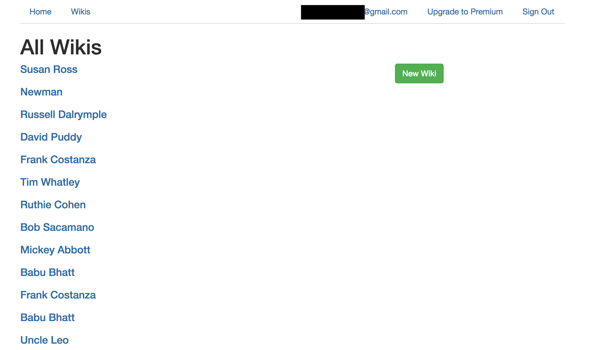
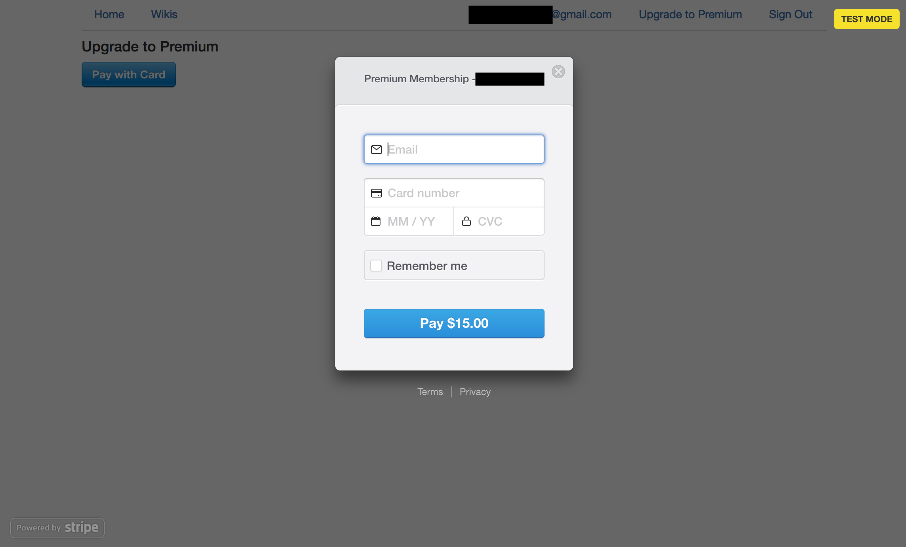
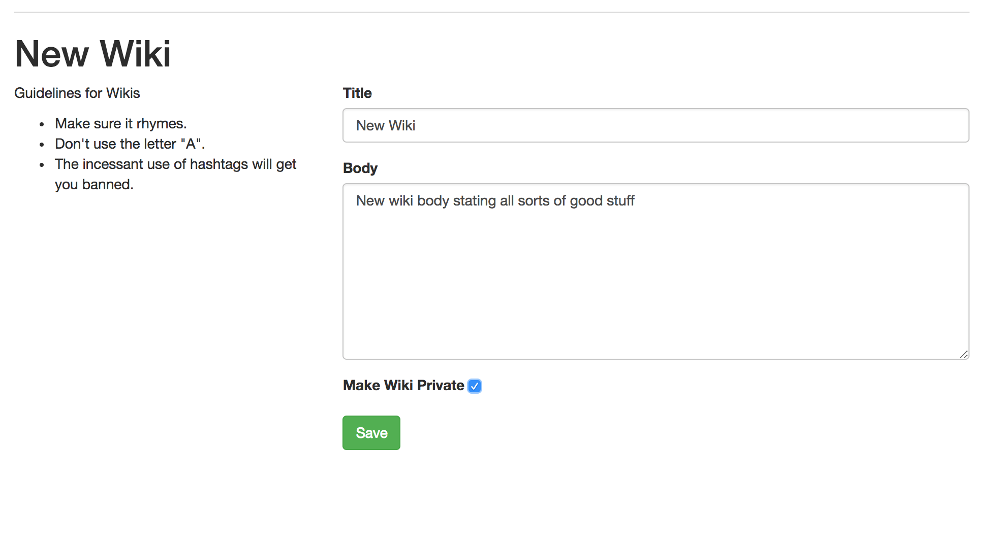
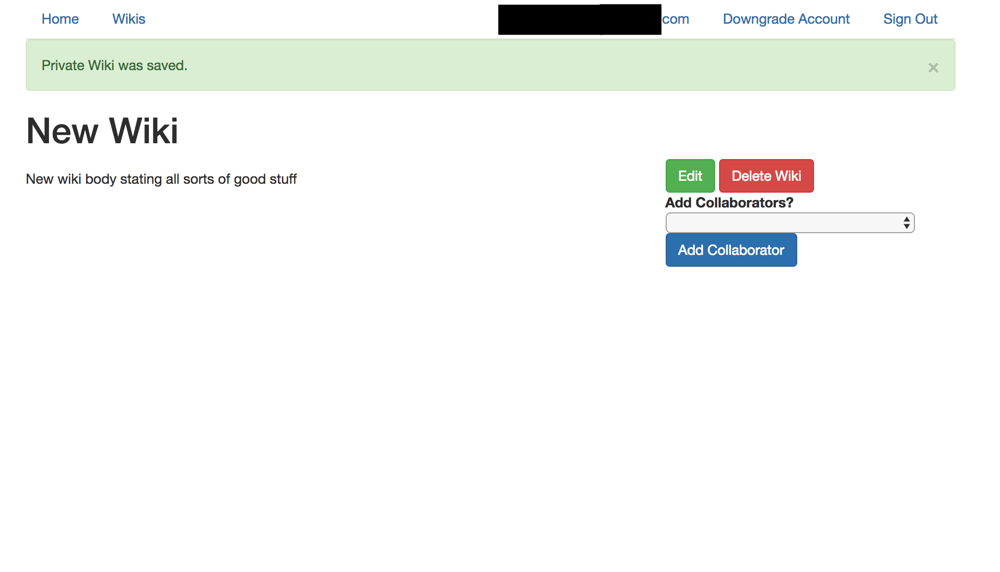

## Webipedia

**About**

Webipedia is place to learn and collaborate on various topics. Sign-up and confirm your email address to gain access to all of the topics the app has to offer. Upgrade to a Premium Membership to create private topics and choose collaborators (premium members or not) with whom you wish to work. Enjoy!

**Wikis**

**Upgrade to Premium**

**Create New Wiki**

**Add collaborators to Private Wiki**

**Specs**

Webipedia was built with Ruby on Rails. Email sign-up and confirmations built with Devise gem. Premium membership upgrade processed via Stripe. Sample Wiki database seeded with Faker gem.
